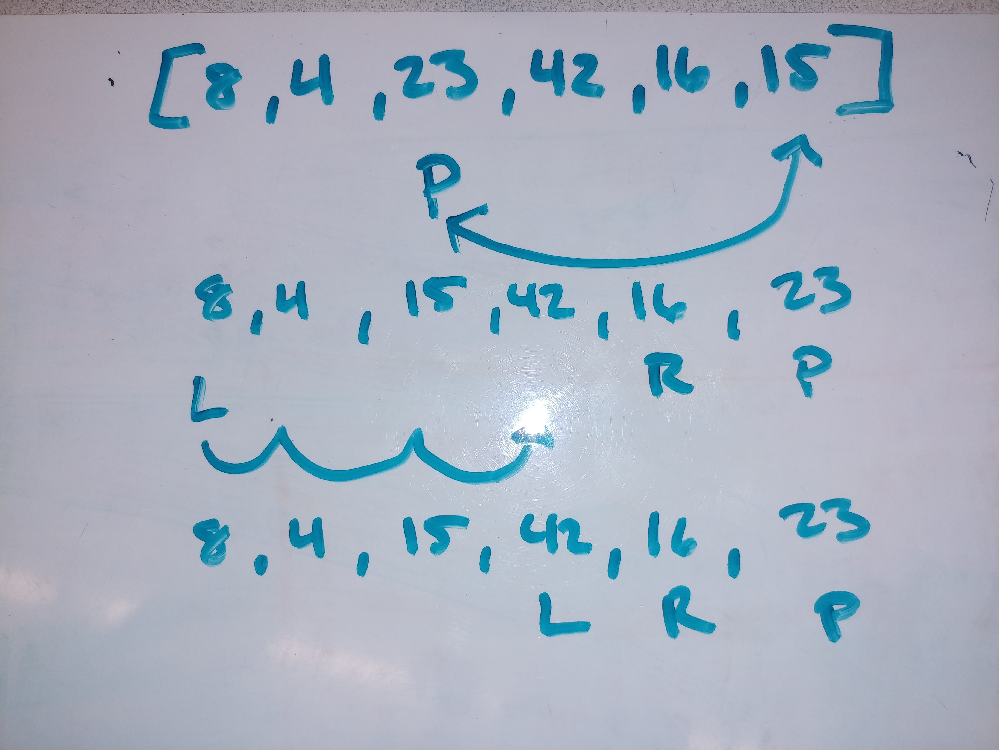
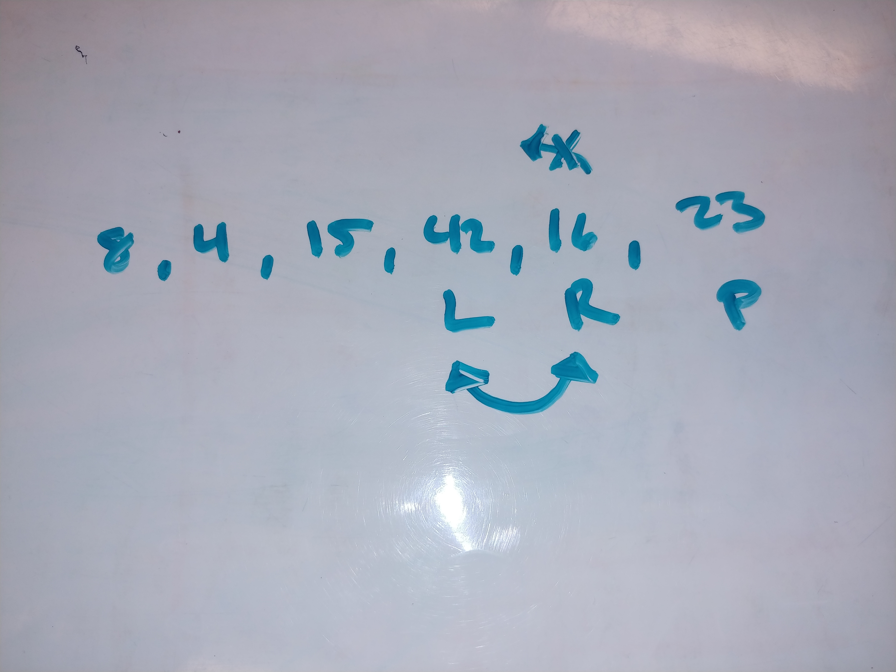
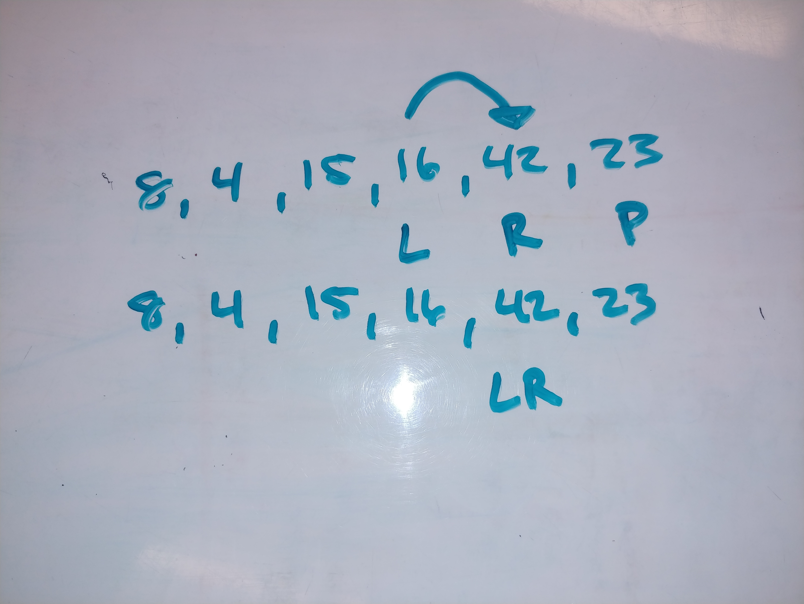
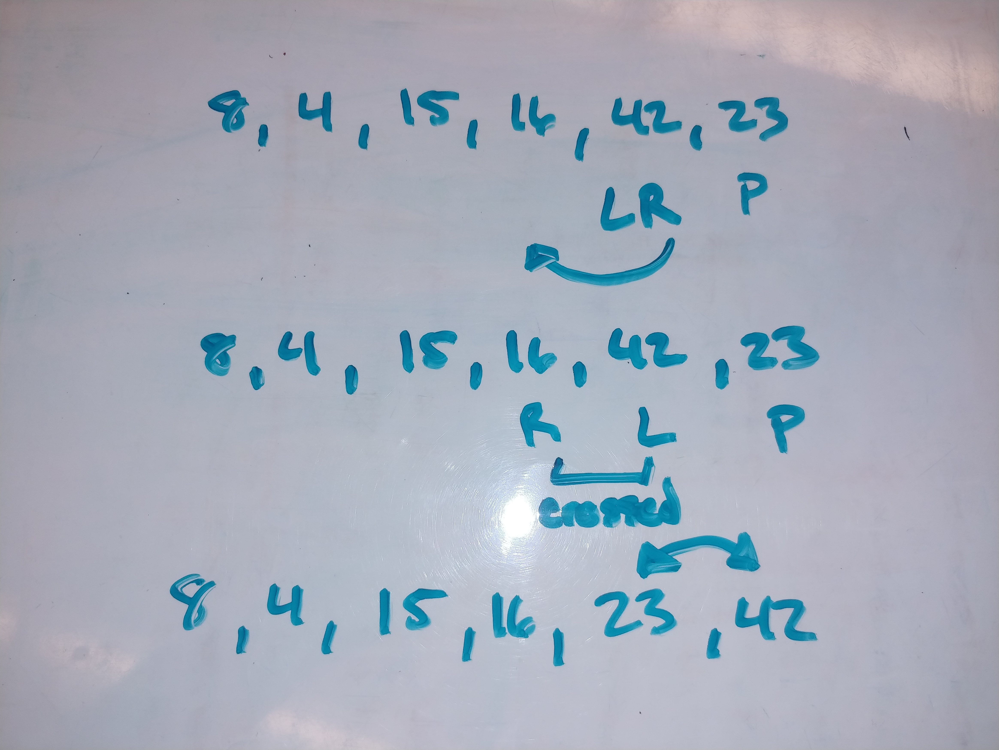
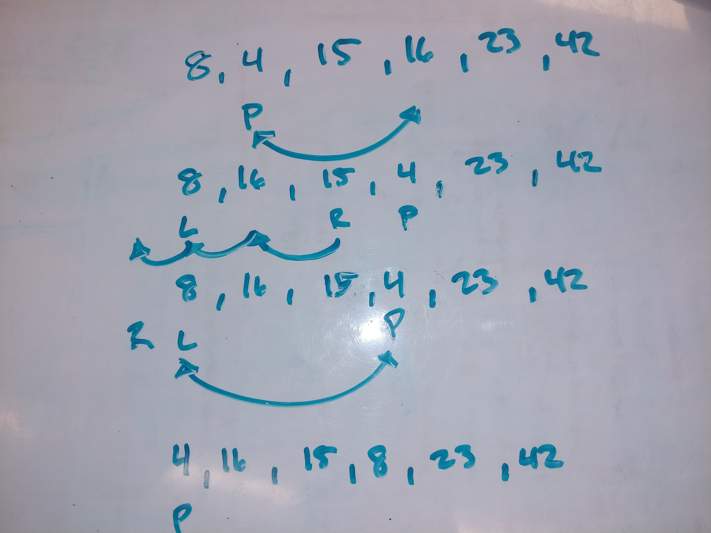
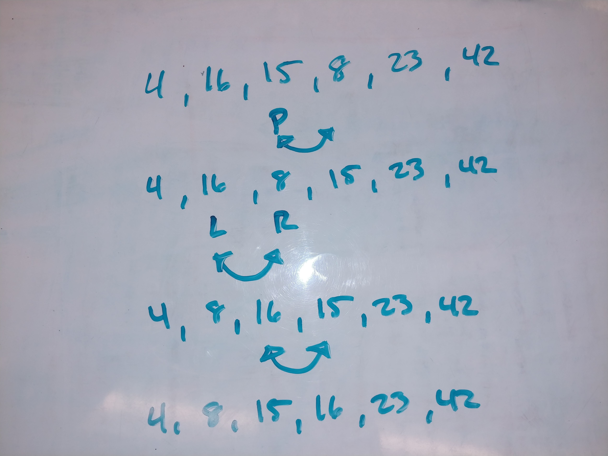

# MERGE SORT

## PSUEDO CODE

    ALGORITHM QuickSort(arr, left, right)
        if left < right
            // Partition the array by setting the position of the pivot value 
            DEFINE position <-- Partition(arr, left, right)
            // Sort the left
            QuickSort(arr, left, position - 1)
            // Sort the right
            QuickSort(arr, position + 1, right)

    ALGORITHM Partition(arr, left, right)
        // set a pivot value as a point of reference
        DEFINE pivot <-- arr[right]
        // create a variable to track the largest index of numbers lower than the defined pivot
        DEFINE low <-- left - 1
        for i <- left to right do
            if arr[i] <= pivot
                low++
                Swap(arr, i, low)

        // place the value of the pivot location in the middle.
        // all numbers smaller than the pivot are on the left, larger on the right. 
        Swap(arr, right, low + 1)
        // return the pivot index point
        return low + 1

    ALGORITHM Swap(arr, i, low)
        DEFINE temp;
        temp <-- arr[i]
        arr[i] <-- arr[low]
        arr[low] <-- temp

## Sample Array

[8, 4, 23, 42, 16, 15]

## Walkthrough

First the pivot value is found and it is moved to the end of the array. The array is partitioned and the L is set to the 0 index and the R is set to the end not including the pivot. Then the L is moved to the right until it reaches a value greater or equal to the pivot. 

This round the R is moved to the left until it reaches a value that is less that the pivot or it crosses the L. In this case it is already on a value less that the pivot so it does not have to travel.

The L and R values are then swapped. The L moves to the right until it reaches a value greater or equal to the pivot. So the L moves one spot to the right and the L and R are at the 4th index spot.

Now the R moves left until it reaches a value lower than the pivot or it crosses the L. Here it crosses the L which means that all the elements that are to the left of the L are less than the pivot. So the left and the pivot swap.

Now quickSort is called on the left sub array and a new pivot is selected. The pivot swaps with the last value of the sub array. Then the L and R bounds are established. The left moves right until it finds a value greater or equal to the pivot, not moving in this case. The R travels left searching for a lesser or equal to the pivot and crosses the bounds of the left. Now all items to the left of the L are less than the pivot and items right of the L are greater. The pivot switches with the L.

Now quickSort is called on the final sub array and the same processes are repeated. The pivot moves to the end. The L and R move until bounds are met and the values are swapped. Then The L and R are moved again until the pivot and R are swapped resulting in a sorted array.

## Efficiency
Time: O(n log n)

Space: O(log n)
