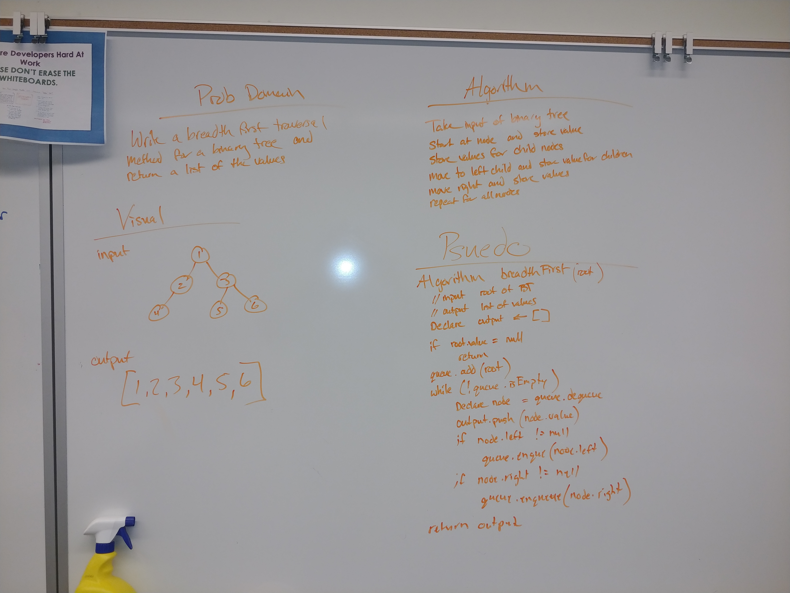

# Breadth First Traversal

Write a function that finds the highest value in a Binary Tree.

## Challenge

Write an instance method called find-maximum-value. Without utilizing any of the built-in methods available to your language, return the maximum value stored in the tree. You can assume that the values stored in the Binary Tree will be numeric.

## Approach & Efficiency
* findMaxValue - O(n)

## API
* findMaxValue - traverses a binary tree inOrder and returns the highest value.

## Links and Resources
[link to BinaryTree module]()

[Submission PR]()

[Travis-ci]()

#### Documentation
Run live-server on /doc files for full code documentation

## Solution

