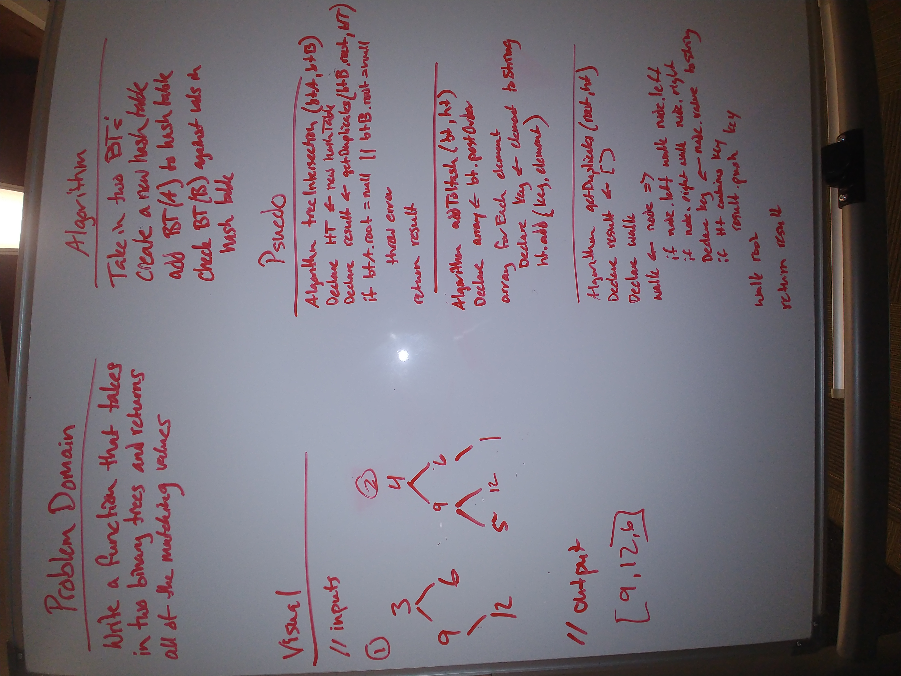

# Tree Intersection Challenge

Find common values in 2 binary trees.

## Challenge

Write a function called treeIntersection that takes in two binary tree parameters and returns all of the matching values.

## Approach & Efficiency
* `treeIntersection` - 0(2n)
* `_addToHash` - O(n)
* `_getDuplicates` - O(n)

## API
* `treeIntersection(btA, btB)` - Takes in two binary trees and outputs any matching values.
* `_addToHash(bt, ht)` - takes in a binary tree and hash table and inserts values of tree into table.
* `_getDuplicates(root, ht)` - Takes in binary tree root and hash table and compares the tree to the values in the hash table. Returns array of matching values. 

## Links and Resources

[Submission PR](https://github.com/tskyles-401-advanced-javascript/data-structures-and-algorithims/pull/21)

[Travis-ci](https://travis-ci.com/tskyles-401-advanced-javascript/data-structures-and-algorithims)

#### Documentation
Run live-server on /doc files for full code documentation

## Solution

